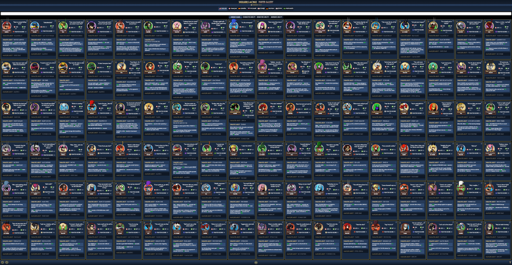

# Skullgirls Mobile Collection Gallery
A collection gallery for Skullgirls Mobile.
View the stats and abilities of every fighter variant and move, translated in any language offered in the game.

The version number seen on the website indicates the version of the game from which data has been gathered.
The website will only be updated for game updates that introduce new units, alter existing units, or fix translations.
If the website version is 3.0.0 but the latest game version is 3.0.2, the website probably still contains accurate information.

## Features

### Language

All of the language options available in the game are available on the website.
The localizations are exactly as they are in the game (except for a few terms like `Gallery`, `Ratings`, `Variant`, `Name`, `Votes`, and `You`, which the game data does not have exact translations for; machine translation assisted here).

*Your chosen language option is saved in your browser's local storage for future visits.*

### Rating System

At the developers' request, I have implemented a rudimentary rating system to show the community's opinion on each fighter variant.
To enable the rating system, just click on the star at bottom right of the website.
This will also reveal two more sorting options based on the two ratings on each card.

The rating system uses Firebase to keep track of votes.
One vote is allowed per browser session.
All votes are weighted by their age in days and by the number of votes made at the same IP address.

*For quota reasons, the rating system toggle state is not saved in your browser's local storage.*

### Options (Fighter Settings)

You can modify the tier, level, skill tree, and ability levels of the displayed fighters from this menu.

#### Stats

When the tier, level, skill tree, or Prestige Ability settings are changed, the attack, health, and Fighter Score values on each card are recalculated.
The formulas used in these calculations are as follows:

If you cannot view the LaTeX below, click here to view it in plaintext.

----
* ATK:
  * `ATK_BOOST = {NO +ATK% NODES: 0, ALL +ATK% NODES: 0.5}`
  * `ATK_LVL_1 = BASE_ATK * (1 + ATK_BOOST)`
  * `ATK_LVL_N = CEIL(ATK_LVL_1 * (1 + (N - 1) / 5))`
* HP:
  * `HP_BOOST = {NO +HP% NODES: 0, ALL +HP% NODES: 0.5}`
  * `HP_LVL_1 = BASE_HP * (1 + HP_BOOST)`
  * `HP_LVL_N = CEIL(HP_LVL_1 * (1 + (N - 1) / 5))`
* FS:
  * `TREE_BOOST = {NO SKILL TREE NODES: 0, ALL SKILL TREE NODES: 0.46}`
  * `MA_BOOST = MA / 100`
  * `PA_BOOST = (PA + (9 if PA > 0 else 0) + (9 if PA > 99 else 0)) / 1000`
  * `FS_BOOST = TREE_BOOST + MA_BOOST + PA_BOOST`
  * `FS_LVL_N = CEIL(((ATK_LVL_N + HP_LVL_N / 6) * 7 / 10) * (1 + FS_BOOST))`
* `ATK_BOOST`, `HP_BOOST`, and `TREE_BOOST` are determined by unlocked skill tree nodes.
* `MA_BOOST` and `PA_BOOST` are determined by the Marquee Ability level and Prestige Ability level.
* `ATK_LVL_N`, `HP_LVL_N`, and `FS_LVL_N` is the stat value when the fighter is level `N`.
* `BASE_ATK` and `BASE_HP` are hard-coded for every tier of every fighter, although they follow the pattern:
  * `BASE_STAT(V) = ROUND(BASE_STAT(V - 1) * 1.95)`
  * `V` is the number of times the fighter was evolved and `BASE_STAT(0)` is known.
  * Rounding is done with the round-half-to-even method.
  * Before version 7.7.0, the more accurate equation was `BASE_STAT(V) = ROUND(BASE_STAT(0) * 1.8 ^ V)`.
    * Rounding was only done once, and the rounding method didn't matter.
    * Before version 4.3.3, Headstrong and Understudy had swapped stats when evolved to diamond tier.
  * For more info and analysis regarding base stats, see my [SGM Evolution Scaling Analysis](https://docs.google.com/spreadsheets/d/1vrwR6ta8gHr1ldXVXqIljYSAq3mnwhdS1uQ6OTcJVzo) spreadsheet.
----

* ATK:
  * $Boost_{ATK} \in [0, 0.5]$
  * $ATK(1) = ATK_{Base} \times \left( 1 + Boost_{ATK} \right)$
  * $ATK(n) = \left\lceil ATK(1) \times \left( 1 + \frac{n - 1}{5} \right) \right\rceil$
* HP:
  * $Boost_{HP} \in [0, 0.5]$
  * $HP(1) = HP_{Base} \times \left( 1 + Boost_{HP} \right)$
  * $HP(n) = \left\lceil HP(1) \times \left( 1 + \frac{n - 1}{5} \right) \right\rceil$
* FS:
  * $Boost_{Tree} \in [0, 0.46]$
  * $Boost_{MA} = \frac{MA}{100} ; MA \in [0, 11]$
  * $Boost_{PA} = \frac{PA + PA_1 + PA_{100}}{1000} ; PA \in [0, 100] ; PA_m = \left\\{ {9 \text{ if } PA \ge m \atop 0 \text{ otherwise }} \right.$
  * $Boost_{FS} = Boost_{Tree} + Boost_{MA} + Boost_{PA}$
  * $FS(n) = \left\lceil \left( ATK(n) + \frac{HP(n)}{6} \right) \times \frac{7}{10} \times \left( 1 + Boost_{FS} \right) \right\rceil$
* $Boost_{ATK}$, $Boost_{HP}$, and $Boost_{Tree}$ are determined by unlocked skill tree nodes.
* $Boost_{MA}$ and $Boost_{PA}$ are determined by the Marquee Ability level and Prestige Ability level.
* $ATK(n)$, $HP(n)$, and $FS(n)$ is the stat value when the fighter is level $n$.
* $ATK_{Base}$ and $HP_{Base}$ are hard-coded for every tier of every fighter, although they follow the pattern:
  * $Stat_{Base}(v) = \text{round} \left( Stat_{Base} \left( v - 1 \right) \times 1.95 \right)$
  * $v$ is the number of times the fighter was evolved and $Stat_{Base}(0)$ is known.
  * Rounding is done with the round-half-to-even method.
  * Before version 7.7.0, the more accurate equation was $Stat_{Base}(v) = \text{round} \left( Stat_{Base}(0) \times 1.8 ^ v \right)$.
    * Rounding was only done once, and the rounding method didn't matter.
    * Before version 4.3.3, Headstrong and Understudy had swapped stats when evolved to diamond tier.
  * For more info and analysis regarding base stats, see my [SGM Evolution Scaling Analysis](https://docs.google.com/spreadsheets/d/1vrwR6ta8gHr1ldXVXqIljYSAq3mnwhdS1uQ6OTcJVzo) spreadsheet.

While I cannot confirm if the game uses these same formulas, the results appear to exactly match the stats of fighters that I have on my own account.
See my [SGM Fighter Score Analysis](https://docs.google.com/spreadsheets/d/1CotgKsKzSIA5siRAMplX7e5k7KRT63a3GSY1XRg-hgc) spreadsheet for more detailed information.

The [Skullgirls Mobile Fighter Data](https://docs.google.com/spreadsheets/d/1goYXai7QUu4IJp76POP1IWyc2_6fEqEmxt9e74qyIgw) spreadsheet, [created by Raidriar and currently maintained by Takio](https://forum.skullgirlsmobile.com/threads/calculated-fighter-stats.392/), is the origin of the initial version of these formulas.
I then modified them until the results perfectly matched in-game stats.

Thanks to bbp, brdv, and qdd for their help in figuring out how Prestige Ability level affects Fighter Score.
They were the ones to notice that both the initial and final Prestige Ability levels provide bonus boosts.
And their method of calculating precise Fighter Scores by using Prize Fight scores helped provide the data needed to verify the accuracy of the new formula.

#### Abilities

The Signature Ability, Marquee Ability, and Prestige Ability settings allow you to preview fighters' abilities at each ability level.
These settings do not affect the tier, level, or skill tree settings and are not considered in the calculation of fighters' attack or health stats.

#### Preset Buttons
The `X` button sets every option to the minimum level.
The `Home` button sets every option to the minimum level except for Signature Ability, which is set to the maximum level.
The `Crown` button every option to the maximum level.

*Your fighter settings are not saved and will be reset on every visit.*

### Filter

All of the filter settings in the game (besides favorite, new, and shiny) are also on the website.
The filters behave just like they do in the game (except for the tier filters, which filter by natural tier rather than evolved tier).

#### Search Box

You can also filter characters based on their variant names or their ability descriptions.
The query processing method is very basic, simply searching for an exact match (ignoring capitalization and extra spaces) instead of separating the query into individual terms.

Base fighter names, quotes, stats, and ability names are not included in these searches.

If you include a hash property in the URL, the website will initialize with the hash property in the search box.
For example, opening https://krazete.github.io/sgm/#Bad%20Hair%20Day will only show Bad Hair Day's card upon page load.

##### Shorthand

The variant data object keys are included in variant name searches because keys often include common shorthand.
For example, the abbreviation BHD refers to Bad Hair Day Filia, whose data is stored with the key `bHDay`.

#### Locks

The lock on the top left corner of each card prevents filters from hiding that card.
This is to ease the process of searching for and comparing between different fighters.

*Your filter settings are not saved and will be cleared on every visit.*

### Sort

The website allows you to sort fighters by in-game options like alphabetically or based on Fighter Score, element, or tier.
The game's energy and level sorting options have not been included since they are not useful in this context.
You can additionally sort by attack, health, offense rating, and defense rating.
The rating sort options only appear when the rating system is enabled.

The website's sorting behavior mimics the game's sorting behavior for the most part.
It even follows the game's `[Fire, Wind, Water, Light, Dark, Neutral]` element sort, which oddly differs the game's filter button order of `[Fire, Water, Wind, Light, Dark, Neutral]`.

The only two differences in sorting behavior are: you cannot reverse sorting order, and sorting by tier sorts by natural tier rather than evolved tier.

*Your chosen sorting option is saved in your browser's local storage for future visits.*

### Zoom

The zoom buttons allow you to increase or decrease card size.
Like the game, there are only three zoom levels.

*Your chosen zoom level is saved in your browser's local storage for future visits.*

### Wikia Links

Every fighter variant has a link on the top right corner of their card which redirects to the Tips and Tricks section of their official [Wikia](https://skullgirlsmobile.wikia.com/) page.

This is possible because the Wikia contributors nearly always name the variant pages consistent with the official capitalization and punctuation.
The only exception I know of is [Hack n' Splash](https://skullgirlsmobile.wikia.com/wiki/Hack_N%27_Splash)'s page with an erroneous uppercase "N," which led to a broken link until I created a redirect page for it.

If you notice a link is redirecting to a nonexistent Wikia page, please try to fix the page title or [notify me about it](#contact).

### Loading

The [loading animation featuring Squigly](image_processing/what.gif) appears whenever a JSON file is being loaded.

I think this was taken from a live stream a few years ago.
I don't quite remember, and I can't find the image anywhere else online.
I know that the artist is one of the members of [Mecha Fetus](http://www.mechafetus.com/) and worked as an artist on Skullgirls.
It's probably Mariel Kinuko Cartwright's artwork.
Or Persona's.
Not sure.

If you recognize where the art is from, please [let me know](#contact) so I can update this section and properly credit the artist.

## Move Gallery

The [Move Gallery](https://krazete.github.io/sgm/moves) features all moves available in the game.
It can be filtered, sorted, and searched through much like the Fighter Gallery and includes one level setting.

This gallery still lacks the following features:

* damage intensity information (none, very low, low, med, high, very high, ultra)
* upgrade and sell costs
* information about whether a move is a throw, grab, or projectile

## Catalyst Gallery

The [Catalyst Gallery](https://krazete.github.io/sgm/catalysts) features all catalysts available in the game.
It can be filtered, sorted, and searched through much like the Fighter Gallery and includes one level setting.

## Versions

Each tag in this repository marks a different version of this gallery.

* v0 (First Draft): The gallery is initialized with information taken from [the forums](https://forum.skullgirlsmobile.com/) and portraits incompletely processed from screenshots.

* v1 (Second Draft): Information is now mined from version 2.6.1 of the game. There are new language options, filters, and settings. The design has been improved and more portraits have been added.

* v2 (Final Draft): The gallery now resembles what it looks like today. The design has been dramatically improved and all portraits have been added ~~thanks to screenshots from the Rift beta~~. All settings, filters, sorting options, and whatnot have been refined. The gallery is in its first "completed" state, matching up with game version 3.0.0.

* v3 (Move Gallery): A Move Gallery has been added. Images are missing and some moves are missing entirely. The basic filter, sort, and setting options are included.

* v4 (Rating System): A rating system has been added, along with a rating toggle button to hide ratings and return to the original, more compact design.

* v5 (Asset Upgrade): Portraits are now supplied by HVS and the masks have been refined. The Move Gallery is also populated with images and previously missing move entries have been added. Game version has been updated to 3.1.0. A new Gallery Ratings page has been added to show all ratings in a more condensed format.

* v6 (Catalysts and Collaboration): Processing files have been moved to ~~Krazete/sgmminer~~ Krazete/sgmprocessor. The CONTRIBUTING.md document has been added detailing how to manually update gallery data files. A rudimentary Catalyst Gallery has been added.

* v7 (Repair and Prestige): I neglected the website for over a year because my processing scripts kept failing more and more with each new game update: bugged ability data, missing fighter data, no access to move data, broken ratings page, etc. I finally fixed Krazete/sgmprocessor in January 2023 by switching from UABE to UnityPy. This new library helped facilitate the complete repair of the website as well as implementation of the new Prestige Ability feature. The Catalyst Gallery was also completed a few months later in May. (And I deleted CONTRIBUTING.md because nobody helps anyway.)

## Issues

### Compatibility

I spent the entire design process with Google Chrome in mind.
I also briefly tested in Safari and fixed some bugs specific to iOS and MacOS, but I have not thoroughly tested the website in other browsers.

Because the game itself does not run on outdated systems (or at least not on my iPad Mini 1), I do not plan on accommodating to older browsers.
The website's extensive use of the CSS Grid would also make fixing compatibility issues quite difficult.

If you are having trouble using the website on an updated browser, please [contact me about the issue](#contact).

### Contact

Send any messages to krazete@gmail.com or through Discord to @Krazete#7038.
